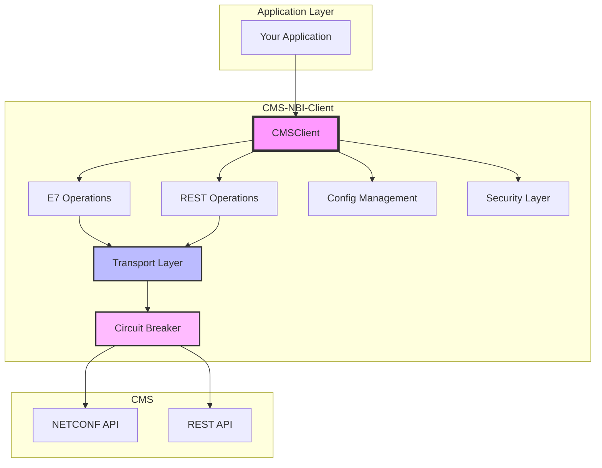

# CMS-NBI-Client Documentation

<div align="center">

[](https://github.com/somenetworking/CMS-NBI-Client/actions/workflows/ci.yml)
[](https://pypi.org/project/cms-nbi-client/)
[](https://github.com/somenetworking/CMS-NBI-Client/blob/main/LICENSE)
[](https://cms-nbi-client.readthedocs.io/en/latest/?badge=latest)

</div>

## Welcome

**CMS-NBI-Client** is a modern, async-first Python client for interacting with Calix Management System (CMS) Northbound Interface (NBI). Built with performance, security, and developer experience in mind.

!!! warning "Disclaimer"
    This package is not owned, supported, or endorsed by Calix. It's an independent implementation for interacting with CMS NBIs.

## Key Features

<div class="grid cards" markdown>

-   :rocket: **Modern Async/Await**  
    Built on `aiohttp` for high-performance async operations with full backwards compatibility

-   :lock: **Enterprise Security**  
    HTTPS support, encrypted credential storage, and protection against XML attacks

-   :zap: **High Performance**  
    Connection pooling, circuit breakers, and concurrent operations support

-   :wrench: **Developer Friendly**  
    Type hints, Pydantic validation, structured logging, and comprehensive documentation

</div>

## Quick Example

```python
import asyncio
from cmsnbiclient import CMSClient, Config

async def main():
    # Configure client
    config = Config(
        credentials={
            "username": "your_username",
            "password": "your_password"
        },
        connection={
            "host": "cms.example.com"
        }
    )
    
    # Use async context manager
    async with CMSClient(config) as client:
        # Query ONT
        ont = await client.e7.query_ont(
            network_name="NTWK-1",
            ont_id="123"
        )
        print(f"ONT Status: {ont['admin_state']}")
        
        # Create multiple ONTs concurrently
        tasks = [
            client.e7.create_ont(
                network_name="NTWK-1",
                ont_id=str(i),
                admin_state="enabled"
            )
            for i in range(10)
        ]
        results = await asyncio.gather(*tasks)
        print(f"Created {len(results)} ONTs")

# Run the async function
asyncio.run(main())
```

## Why CMS-NBI-Client v2?

The version 2.0 represents a complete modernization:

| Feature | v0.1.0 | v2.0.0 |
|---------|--------|--------|
| **Architecture** | Synchronous | Async-first with sync wrapper |
| **Protocol** | HTTP only | HTTPS default with HTTP fallback |
| **Performance** | Sequential operations | Concurrent with connection pooling |
| **Security** | Plain text credentials | Encrypted storage, XML validation |
| **Error Handling** | Basic exceptions | Circuit breakers, retries |
| **Configuration** | Dictionary-based | Pydantic models with validation |
| **Logging** | Print statements | Structured logging with context |
| **Testing** | None | Comprehensive test suite |
| **Documentation** | Basic README | Full API docs with examples |

## Architecture Overview



## Next Steps

<div class="grid cards" markdown>

-   :material-download: **[Installation Guide](guides/installation.md)**  
    Get started with pip or poetry installation

-   :material-rocket-launch: **[Quick Start Tutorial](guides/quickstart.md)**  
    Your first CMS-NBI-Client application in 5 minutes

-   :material-book-open-variant: **[User Guide](guides/basic-usage.md)**  
    Comprehensive guide to all features

-   :material-api: **[API Reference](api/client.md)**  
    Detailed API documentation with examples

</div>

## Support

- **Issues**: [GitHub Issues](https://github.com/somenetworking/CMS-NBI-Client/issues)
- **Discussions**: [GitHub Discussions](https://github.com/somenetworking/CMS-NBI-Client/discussions)
- **Security**: See [Security Policy](https://github.com/somenetworking/CMS-NBI-Client/security/policy)

## License

This project is licensed under the [GPL-3.0 License](https://github.com/somenetworking/CMS-NBI-Client/blob/main/LICENSE).